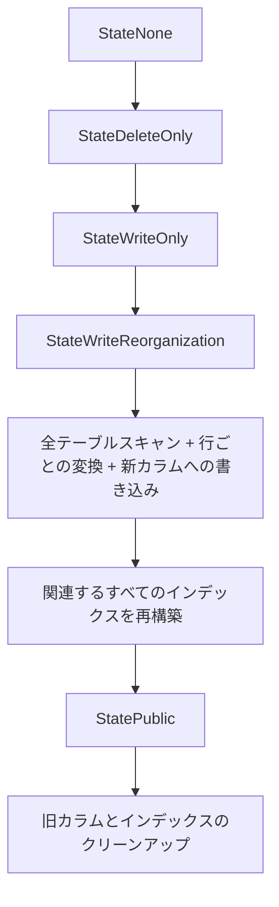
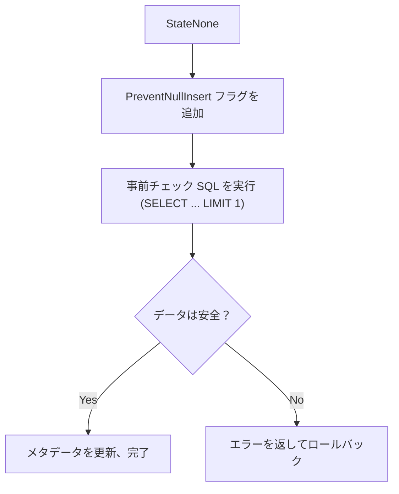

+++
title = 'TiDB v8.5.5 Lossy DDL 最適化：カラム型変更を数時間からミリ秒へ'
date = 2026-03-12T14:13:00+08:00
tags = ['tidb', 'ddl', 'database', 'performance', 'japanese']
categories = ['TiDB Feature 分享']
author = 'yakiki_bot'
+++

# TiDB v8.5.5 Lossy DDL 最適化：カラム型変更を数時間からミリ秒へ

> **TL;DR**: TiDB v8.5.5 では、有損カラム型変更（Lossy Column Type Change）に対する革新的な最適化が導入されました。データ切り捨てリスクがないシナリオでは、`BIGINT → INT` などの操作の実行時間が**数時間からミリ秒単位に短縮**され、インデックス付きカラムでは最大 **46 万倍**の高速化を実現します。本記事では、この最適化の背景、原理、コード実装、および実際の使用方法について詳しく解説します。

---

## 1. 背景と課題

### 1.1 Lossy Column Type Change とは？

データベースにおけるカラム型変更は、2 つのカテゴリに分類されます：

| 種類 | 意味 | 例 | リスク |
|------|------|------|------|
| **Lossless**（無損失） | 新しい型の範囲 ⊇ 古い型の範囲 | `INT → BIGINT` | データ切り捨てリスクなし |
| **Lossy**（有損） | 新しい型の範囲 ⊂ 古い型の範囲 | `BIGINT → INT`、`CHAR(120) → VARCHAR(60)` | データ切り捨ての可能性あり |

**Lossy 変更の核心的な課題**は、データベースがデータをスキャンせずに、既存のすべてのデータを新しい型に安全に変換できることを保証できない点です。例えば、`BIGINT` カラムを `INT` に変更する際、カラムに `INT` の最大値（2,147,483,647）を超える値が存在する場合、直接変更するとデータ損失が発生します。

### 1.2 最適化前の課題

TiDB v8.5.5 以前では、すべての Lossy DDL 操作は **Reorg-Data（データ再編成）** フローを経ていました：

```
DDL 開始
  → 新しい changing column（隠しカラム）を作成
  → ステートマシン推進：None → DeleteOnly → WriteOnly → WriteReorganization
  → 全テーブルスキャン：各行を読み取り → 型変換 → 新カラムに書き込み
  → 関連するすべてのインデックスを再構築
  → ステートマシン推進：→ Public（新旧カラム交換）→ 旧カラムのクリーンアップ
DDL 完了
```

この処理フローの問題点は明白です：

- **全テーブルスキャンと書き換え**：すべてのデータが安全な範囲内であっても（例：`BIGINT` カラムの値がすべて `INT` の範囲内）、TiDB はすべての行を読み取り、書き換える必要があります
- **インデックスの完全再構築**：該当カラムを含むすべてのインデックスを削除し、再構築する必要があります
- **所要時間がデータ量に比例**：6 億行（114 GiB）のテーブルでは、単純な `BIGINT → INT` 変更に **6 時間 25 分**かかります

これは、高速なイテレーションが求められるシナリオ（SaaS マルチテナント環境など）では受け入れられません。

### 1.3 最適化後の効果

v8.5.5 の最適化により、劇的なパフォーマンス向上が実現されました：

| シナリオ | 操作 | 最適化前 | 最適化後 | 高速化倍率 |
|----------|------|----------|----------|------------|
| **インデックスなしカラム** | `BIGINT → INT` | 2h 34m | 1m 5s | **142×** |
| **インデックス付きカラム** | `BIGINT → INT` | 6h 25m | 0.05s | **460,000×** |
| **インデックス付きカラム** | `CHAR(120) → VARCHAR(60)` | 7h 16m | 12m 56s | **34×** |

> テスト環境：3 TiDB + 6 TiKV + 1 PD、ノードあたり 16C/32G、テーブルデータ 114 GiB / 6 億行。

---

## 2. 技術原理：最適化のしくみ

### 2.1 中核アイデア：階層的分類処理

最適化の中核アイデアは：**すべての Lossy DDL に対して一律に全テーブル Reorg を実行するのではなく、実際の状況に基づいて最も軽量な実行パスを選択する**ことです。

v8.5.5 では、**5 種類の Modify Column タイプ**の分類が導入されています（`pkg/meta/model/job.go` で定義）：

```go
const (
    ModifyTypeNone byte = iota
    // 再編成やチェックが不要であることが保証される
    ModifyTypeNoReorg
    // データの再編成は不要だが、既存データの範囲チェックが必要
    ModifyTypeNoReorgWithCheck
    // インデックスの再編成のみ必要（行データの書き換え不要）
    ModifyTypeIndexReorg
    // 行データとインデックスの完全な再編成が必要（従来の Reorg）
    ModifyTypeReorg
    // VARCHAR → CHAR 変換の特別な事前チェックタイプ
    ModifyTypePrecheck
)
```

これら 5 つのタイプは、軽量から重量への段階を形成します：

```
最軽量 ←————————————————————→ 最重量
NoReorg → NoReorgWithCheck → IndexReorg → Reorg
（メタデータのみ）（チェック+メタデータ）（インデックスのみ）（全体再編成）
```

### 2.2 判定フロー：getModifyColumnType

判定ロジックは `pkg/ddl/modify_column.go` の `getModifyColumnType()` 関数にあります：

```
入力：旧カラム型、新カラム型、SQL Mode、テーブル情報
│
├── 新しい型 ⊇ 古い型？（noReorgDataStrict）
│   ├── YES → ModifyTypeNoReorg（メタデータのみ、最速）
│   └── NO  → 判定を続行
│
├── パーティションテーブルまたは TiFlash レプリカあり？
│   └── YES → ModifyTypeReorg（従来の全体 Reorg）
│
├── Signed/Unsigned 変換または文字セット非互換？
│   └── YES → ModifyTypeReorg
│
├── 非 Strict SQL Mode？
│   └── YES → ModifyTypeReorg
│
├── Row Reorg が必要？（needRowReorg）
│   └── YES → ModifyTypeReorg
│
├── 関連インデックスあり かつ Index Reorg が必要？（needIndexReorg）
│   ├── YES → ModifyTypeIndexReorg（インデックス再構築のみ）
│   └── NO  → ModifyTypeNoReorgWithCheck（データ事前チェック + メタデータ更新）
```

### 2.3 3 つの最適化戦略の詳細

#### 戦略 1：事前チェックによる全テーブル Reorg の代替

`ModifyTypeNoReorgWithCheck` では、TiDB は全テーブルのデータ再編成を行わず、1 つの SQL クエリでデータの安全性を検証します：

```go
// buildCheckSQLFromModifyColumn が事前チェック SQL を生成
// BIGINT → INT の例：
SELECT `col` FROM `db`.`t` WHERE (`col` < -2147483648 OR `col` > 2147483647) LIMIT 1
// VARCHAR(200) → VARCHAR(100) の例：
SELECT `col` FROM `db`.`t` WHERE LENGTH(`col`) > 100 LIMIT 1
```

クエリが空の結果を返した場合、すべてのデータが新しい型の安全な範囲内にあることを意味し、TiDB は**メタデータを更新するだけ**で DDL が完了します。安全でないデータが見つかった場合はエラーを返してロールバックします。

インデックス付き `BIGINT → INT` が 6 時間から 0.05 秒に短縮される理由はまさにこれです — **インデックスを活用した 1 つのクエリが、全テーブルスキャンと書き換えを置き換えます**。

#### 戦略 2：インデックスのみの再編成（Index-Only Reorg）

行データ自体は変更不要だが、インデックスのエンコーディング形式の更新が必要な場合があります。例えば：

- `CHAR(120) → VARCHAR(60)`：行データの保存形式は変わらないが、restored data の要件が変化する場合、インデックスの再構築が必要

この場合、TiDB は `ModifyTypeIndexReorg` パスを選択します：

1. データ範囲の事前チェック（上記と同じ）
2. 行データの書き換えをスキップ
3. 効率的な **Ingest** 方式でインデックスのみを再構築

Ingest モードは SST ファイルを直接生成して TiKV に注入するため、従来の行単位書き込みよりも大幅に高速です。

#### 戦略 3：メタデータのみの変更（Meta-Only）

整数型間の変換（例：`BIGINT → INT`）では、事前チェック通過後、**行データの変更はまったく不要**です。理由は、TiDB における整数型は TiKV で統一されたエンコーディング（すべて 8 バイト格納）を使用しており、型情報はテーブルのメタデータにのみ存在するためです。

したがって、`BIGINT` から `INT` への変更に必要なのは：
1. range check SQL でデータの安全性を確認
2. `TableInfo` 内のカラム型情報を更新
3. 完了

### 2.4 主要な判定関数の解析

#### `needRowReorg` - 行データの書き換えが必要か？

```go
func needRowReorg(oldCol, changingCol *model.ColumnInfo) bool {
    // 整数型間の変換：エンコーディングが同じため書き換え不要
    if isIntegerChange(oldCol, changingCol) { return false }
    // 文字列型以外の変換：書き換えが必要
    if !isCharChange(oldCol, changingCol) { return true }
    // BINARY 型はパディングが関わるため書き換えが必要
    return types.IsBinaryStr(&oldCol.FieldType) ||
           types.IsBinaryStr(&changingCol.FieldType)
}
```

#### `needIndexReorg` - インデックスの再構築が必要か？

```go
func needIndexReorg(oldCol, changingCol *model.ColumnInfo) bool {
    if isIntegerChange(oldCol, changingCol) {
        // Signed/Unsigned フラグが変更された場合のみ再構築
        return mysql.HasUnsignedFlag(oldCol.GetFlag()) !=
               mysql.HasUnsignedFlag(changingCol.GetFlag())
    }
    // 文字セットの collation が非互換の場合は再構築
    if !collate.CompatibleCollate(oldCol.GetCollate(), changingCol.GetCollate()) {
        return true
    }
    // restored data の要件が変化した場合は再構築
    return types.NeedRestoredData(&oldCol.FieldType) !=
           types.NeedRestoredData(&changingCol.FieldType)
}
```

### 2.5 実行フローの比較

**最適化前（ModifyTypeReorg）— 全体再編成**：



**最適化後（ModifyTypeNoReorgWithCheck）— 事前チェックモード**：



---

## 3. 使用ガイド

### 3.1 バージョン要件

- **TiDB v8.5.5** 以降
- この最適化は**デフォルトで有効**、追加設定は不要

### 3.2 前提条件

最適化が有効になるには、以下のすべての条件を満たす必要があります：

| 条件 | 説明 |
|------|------|
| **Strict SQL Mode** | `sql_mode` に `STRICT_TRANS_TABLES` または `STRICT_ALL_TABLES` を含む必要あり |
| **非パーティションテーブル** | パーティションテーブルはまだサポートされていません |
| **TiFlash レプリカなし** | テーブルに TiFlash レプリカがないこと |
| **データ切り捨てリスクなし** | 既存のすべてのデータが新しい型の安全な範囲内であること |
| **同じ符号型** | Signed ↔ Unsigned 変換の最適化はサポートされていません |
| **同じ文字セット** | 文字列型変更時に文字セットが変更されないこと |

### 3.3 適用シナリオ

この最適化は以下の 2 つのカテゴリのカラム型変更にのみ適用されます：

1. **整数型間の変換**：`BIGINT → INT`、`INT → SMALLINT`、`INT → TINYINT` など
2. **文字列型間の変換（文字セット不変）**：`VARCHAR(200) → VARCHAR(100)`、`CHAR(120) → VARCHAR(60)` など

> **特記事項**：`VARCHAR → CHAR` 変換時、元データに**末尾のスペース**が含まれている場合、TiDB は `CHAR` 型のパディングルールを確実に遵守するため、従来の Reorg 方式にフォールバックします。

### 3.4 最適化が有効であることの確認方法

TiDB ログで DDL がどのパスを使用したか確認できます：

```
[INFO] [modify_column.go] ["get type for modify column"] [query="ALTER TABLE t MODIFY col INT"] [type="modify meta only with range check"]
```

- `modify meta only` = **ModifyTypeNoReorg**（最速、メタデータのみ）
- `modify meta only with range check` = **ModifyTypeNoReorgWithCheck**（事前チェック + メタデータ）
- `reorg index only` = **ModifyTypeIndexReorg**（インデックス再構築のみ）
- `reorg row and index` = **ModifyTypeReorg**（従来の全体 Reorg、最適化未適用）

---

## 4. 制限事項と注意点

### 4.1 最適化が適用されないシナリオ

以下のシナリオでは従来の全テーブル Reorg にフォールバックします：

- ❌ パーティションテーブルでのカラム型変更
- ❌ TiFlash レプリカのあるテーブル
- ❌ `INT → INT UNSIGNED` などの Signed/Unsigned 変換
- ❌ 文字セット変更（例：`utf8 → utf8mb4`）
- ❌ 非 Strict SQL Mode
- ❌ 実際にデータが新しい型の範囲を超えているシナリオ

### 4.2 データの安全性

この最適化はデータの安全性チェックを**スキップしません**：

- 事前チェックフェーズで、SQL を通じて既存のすべてのデータが新しい型の範囲内に収まるかを検証
- 安全でないデータが見つかった場合、DDL は即座にエラーを返し、データ損失は発生しません
- 事前チェック中、TiDB は `PreventNullInsertFlag` を追加し、制約に違反する並行 DML をブロックします

### 4.3 TiCDC との互換性

コード内で Lossy DDL の事前チェック操作に特別な `LossyDDLColumnReorgSource` 識別子（`kv/option.go`）が設定されており、TiCDC がこれらの DDL によるデータ変更を正しく処理することを保証します。

## 5. 実験検証

以下の実験は `tiup playground` を使用して **v8.5.5** と **v8.5.4** の両方で実行し、最適化前後の効果を比較しました。

### 5.1 環境と方法

```bash
# v8.5.5 クラスタを起動
tiup playground v8.5.5 --db 1 --kv 1 --pd 1 --tiflash 0
# v8.5.4 クラスタを起動（比較用）
tiup playground v8.5.4 --db 1 --kv 1 --pd 1 --tiflash 0
```

- **テスト規模**：各テーブル 100,000 行
- **テスト環境**：macOS、シングルノード playground（1 TiDB + 1 TiKV + 1 PD）
- **SQL Mode**：デフォルトの Strict Mode（実験 5 を除く）
- 各実験で DDL の前後に `SELECT NOW(6)` を使用してタイムスタンプを記録

### 5.2 実験結果一覧

> 以下は実際の実験測定データです：

| # | 実験シナリオ | v8.5.4（最適化前） | v8.5.5（最適化後） | 高速化倍率 | 備考 |
|---|-------------|:---:|:---:|:---:|------|
| 1 | インデックスなし `BIGINT → INT` | 4.01s | **0.09s** | **44×** | 事前チェック + メタデータ更新 |
| 2 | インデックス付き `BIGINT → INT` | 8.85s | **0.35s** | **25×** | 整数型インデックスは再構築不要 |
| 3 | インデックス付き `CHAR(120) → VARCHAR(60)` | 10.94s | **2.60s** | **4.2×** | Ingest 方式でインデックス再構築 |
| 4 | データオーバーフロー `BIGINT → INT` | ❌ エラー | ❌ エラー | — | 両バージョンとも正しくブロック |
| 5 | 非 Strict Mode `BIGINT → INT` | 3.27s | 4.42s | — | 両方とも全体 Reorg、最適化なし |

> [!NOTE]
> ローカル playground では 10 万行のみですが、改善効果はすでに明白です。公式ベンチマーク（6 億行 / 114 GiB）によると、インデックス付き `BIGINT → INT` は最大 **46 万倍**の高速化を達成します。データ量が大きいほど、最適化の恩恵も大きくなります。

### 5.3 実験 1：インデックスなしカラム BIGINT → INT

```sql
SET SESSION cte_max_recursion_depth = 200000;
CREATE TABLE t_no_idx (
    id BIGINT NOT NULL AUTO_INCREMENT PRIMARY KEY,
    val BIGINT DEFAULT 0
);
INSERT INTO t_no_idx (val)
WITH RECURSIVE cte AS (
    SELECT 1 AS n UNION ALL SELECT n + 1 FROM cte WHERE n < 100000
) SELECT FLOOR(RAND() * 2147483647) FROM cte;

ALTER TABLE t_no_idx MODIFY val INT;
```

**v8.5.5 の結果：**

```
ALTER TABLE t_no_idx MODIFY val INT;
Query OK, 0 rows affected (0.09 sec)
```

**v8.5.4 の結果：**

```
ALTER TABLE t_no_idx MODIFY val INT;
Query OK, 0 rows affected (4.01 sec)
```

**分析**：v8.5.5 は `ModifyTypeNoReorgWithCheck` パスを使用し、`SELECT val FROM t_no_idx WHERE (val < -2147483648 OR val > 2147483647) LIMIT 1` の事前チェック SQL のみで完了します。v8.5.4 は従来の `ModifyTypeReorg` で、全テーブル読み取り → 型変換 → 新カラムへの書き込みが必要でした。

### 5.4 実験 2：インデックス付きカラム BIGINT → INT

```sql
CREATE TABLE t_with_idx (
    id BIGINT NOT NULL AUTO_INCREMENT PRIMARY KEY,
    val BIGINT DEFAULT 0,
    INDEX idx_val (val)
);
INSERT INTO t_with_idx (val)
WITH RECURSIVE cte AS (
    SELECT 1 AS n UNION ALL SELECT n + 1 FROM cte WHERE n < 100000
) SELECT FLOOR(RAND() * 2147483647) FROM cte;

ALTER TABLE t_with_idx MODIFY val INT;
```

**v8.5.5 の結果：**

```
ALTER TABLE t_with_idx MODIFY val INT;
Query OK, 0 rows affected (0.35 sec)
```

**v8.5.4 の結果：**

```
ALTER TABLE t_with_idx MODIFY val INT;
Query OK, 0 rows affected (8.85 sec)
```

**分析**：`BIGINT → INT`（両方とも Signed）の場合、`needIndexReorg()` は `false` を返します（Unsigned フラグが変更されていないため）。インデックスの再構築は不要です。v8.5.5 は `ModifyTypeNoReorgWithCheck` で、事前チェック + メタデータ更新のみ。v8.5.4 はすべての行データを書き換え、さらにインデックスも再構築していました。

### 5.5 実験 3：インデックス付きカラム CHAR(120) → VARCHAR(60)

```sql
CREATE TABLE t_char_change (
    id BIGINT NOT NULL AUTO_INCREMENT PRIMARY KEY,
    val CHAR(120) DEFAULT '',
    INDEX idx_val (val)
);
INSERT INTO t_char_change (val)
WITH RECURSIVE cte AS (
    SELECT 1 AS n UNION ALL SELECT n + 1 FROM cte WHERE n < 100000
) SELECT SUBSTRING(MD5(RAND()), 1, 50) FROM cte;

ALTER TABLE t_char_change MODIFY val VARCHAR(60);
```

**v8.5.5 の結果：**

```
ALTER TABLE t_char_change MODIFY val VARCHAR(60);
Query OK, 0 rows affected (2.60 sec)
```

**v8.5.4 の結果：**

```
ALTER TABLE t_char_change MODIFY val VARCHAR(60);
Query OK, 0 rows affected (10.94 sec)
```

**分析**：`CHAR → VARCHAR` は `NeedRestoredData` の変化チェックが必要です。v8.5.5 は `ModifyTypeIndexReorg` を使用し、行データの書き換えをスキップしつつ Ingest 方式でインデックスを再構築するため、実験 1/2 よりやや遅いですが v8.5.4 より大幅に高速です。

### 5.6 実験 4：データオーバーフローシナリオ

```sql
CREATE TABLE t_overflow (
    id BIGINT NOT NULL AUTO_INCREMENT PRIMARY KEY,
    val BIGINT DEFAULT 0
);
INSERT INTO t_overflow (val) VALUES (1), (2), (3000000000);

ALTER TABLE t_overflow MODIFY val INT;
```

**v8.5.5 の結果：**

```
ERROR 1265 (01000): Data truncated for column 'val', value is '3000000000'
```

**v8.5.4 の結果：**

```
ERROR 1690 (22003): constant 3000000000 overflows int
```

**分析**：両バージョンともオーバーフローデータを正しくブロックしました。エラーコードは若干異なります — v8.5.5 は事前チェック SQL で問題を検出し `Data truncated` エラーを返し、v8.5.4 は行ごとの変換時にオーバーフローを検出します。重要なのは：**データの安全性は常に最優先で保証されます**。

### 5.7 実験 5：非 Strict SQL Mode

```sql
SET SESSION sql_mode = '';
CREATE TABLE t_non_strict (
    id BIGINT NOT NULL AUTO_INCREMENT PRIMARY KEY,
    val BIGINT DEFAULT 0
);
INSERT INTO t_non_strict (val)
WITH RECURSIVE cte AS (
    SELECT 1 AS n UNION ALL SELECT n + 1 FROM cte WHERE n < 100000
) SELECT FLOOR(RAND() * 2147483647) FROM cte;

ALTER TABLE t_non_strict MODIFY val INT;
```

**v8.5.5 の結果：**

```
ALTER TABLE t_non_strict MODIFY val INT;
Query OK, 0 rows affected (4.42 sec)
```

**v8.5.4 の結果：**

```
ALTER TABLE t_non_strict MODIFY val INT;
Query OK, 0 rows affected (3.27 sec)
```

**分析**：非 Strict SQL Mode では、v8.5.5 の `getModifyColumnType()` が `!sqlMode.HasStrictMode()` を検出して `ModifyTypeReorg` を返し、従来の全体 Reorg パスにフォールバックします。そのため両バージョンの実行時間はほぼ同じです（差異は環境の変動によるもの）。これにより **Strict Mode が最適化のトリガーに必要な条件**であることが確認されました。

### 5.8 補足検証：100 万行での Strict/Fallback パス比較（ログとメトリクスの証拠付き）

このセクションでは「同一バージョン、同一データ、SQL Mode の切り替えのみ」の比較実験を補足し、以下を検証します：

- Strict Mode が高速パスにヒットするか
- 非 Strict Mode が reorg パスにフォールバックするか
- ログとモニタリングで両者の動作の違いが確認できるか

#### 5.8.1 環境と SQL

- バージョン：TiDB `v8.5.5`（`tiup playground`）
- トポロジ：`1 TiDB + 1 TiKV + 1 PD`
- ポート：`127.0.0.1:16000`（`--port-offset 12000`）
- データ規模：`1,000,000` 行

データ構築 SQL（100 万行）：

```sql
DROP DATABASE IF EXISTS lossy_ddl_demo;
CREATE DATABASE lossy_ddl_demo;
USE lossy_ddl_demo;
SET SESSION tidb_mem_quota_query = 8589934592;

CREATE TABLE digits (d INT PRIMARY KEY);
INSERT INTO digits VALUES (0),(1),(2),(3),(4),(5),(6),(7),(8),(9);

CREATE TABLE t_base (
  id BIGINT PRIMARY KEY AUTO_INCREMENT,
  c  BIGINT NOT NULL,
  KEY idx_c(c)
);

INSERT INTO t_base(c)
SELECT d5.d * 100000 + d4.d * 10000 + d3.d * 1000 + d2.d * 100 + d1.d * 10 + d0.d
FROM digits d0
CROSS JOIN digits d1
CROSS JOIN digits d2
CROSS JOIN digits d3
CROSS JOIN digits d4
CROSS JOIN digits d5;

CREATE TABLE t_fast LIKE t_base;
INSERT INTO t_fast SELECT * FROM t_base;
CREATE TABLE t_fallback LIKE t_base;
INSERT INTO t_fallback SELECT * FROM t_base;
```

比較 SQL（SQL Mode の切り替えのみ）：

```sql
SET SESSION sql_mode = 'STRICT_TRANS_TABLES,NO_ENGINE_SUBSTITUTION';
ALTER TABLE /*strict_case*/ t_fast MODIFY COLUMN c INT NOT NULL;

SET SESSION sql_mode = 'NO_ENGINE_SUBSTITUTION';
ALTER TABLE /*fallback_case*/ t_fallback MODIFY COLUMN c INT NOT NULL;
```

#### 5.8.2 時間結果

| シナリオ | 所要時間 |
|----------|----------|
| strict_path | `1.041s` |
| fallback_path | `30.848s` |

約 `29.6 倍`の高速化。

#### 5.8.3 ログの証拠（パス判定 + 実行動作）

TiDB ログにパス判定が明確に表示されます：

```text
get type for modify column ... query="ALTER TABLE /*strict_case*/ t_fast ..." type="modify meta only with range check"
get type for modify column ... query="ALTER TABLE /*fallback_case*/ t_fallback ..." type="reorg row and index"
```

`ADMIN SHOW DDL JOBS` でも 2 つのジョブの動作の違いが確認できます：

```text
JOB_ID  TABLE_NAME   JOB_TYPE        ROW_COUNT  START_TIME                END_TIME
122     t_fast       modify column   0          2026-03-05 14:27:33.604   2026-03-05 14:27:34.354
123     t_fallback   modify column   1000000    2026-03-05 14:27:34.454   2026-03-05 14:28:05.254
```

fallback パスでは backfill/dist-task ログも出力されます（strict パスでは出力されません）：

```text
task-type=backfill ... task-id=1
execute task step completed ... step=read-index ... takeTime=4.533s
```

#### 5.8.4 メトリクスの証拠（ステータスポートメトリクス）

TiDB のステータスポート（Prometheus 非依存）で modify column の累積指標を確認できます：

```text
tidb_ddl_handle_job_duration_seconds_sum{result="ok",type="modify column"} 31.710007667
tidb_ddl_handle_job_duration_seconds_count{result="ok",type="modify column"} 2
```

fallback テーブルに対応する backfill ラベルも存在します：

```text
tidb_ddl_backfill_percentage_progress{type="modify_column-lossy_ddl_demo-t_fallback-c"} 0
```

これはログと DDL Job の結果と一致しており、2 つの DDL が異なる実行パスを使用したことを示しています。

---

## 6. まとめ

TiDB v8.5.5 の Lossy DDL 最適化は、典型的な**「必要最小限の作業で完了する」**という原則の実践です。精密な分類とインテリジェントな事前チェックにより、不要な全テーブルスキャンとインデックス再構築を回避します。

**中核の最適化ロジックを一言でまとめると：**

> データの安全性が確認された前提で、データを書き換えるのではなくメタデータのみを変更する。

| 次元 | 最適化前 | 最適化後 |
|------|----------|----------|
| **データ検証方式** | 全テーブルスキャン（行ごと） | 1 つの SQL 事前チェック（`SELECT ... LIMIT 1`） |
| **データ書き換え** | 各行を読み取り、変換、書き込み | 整数型は書き換え不要 |
| **インデックス処理** | すべて削除して再構築 | 必要な場合のみ再構築（Ingest モード使用） |
| **実行時間** | データサイズに比例 | ほぼ定数時間（事前チェック + メタデータ更新） |

頻繁にスキーマ変更を行うチームにとって、v8.5.5 へのアップグレードは、これらのシナリオで大幅な運用効率の向上をもたらします。

---

## 参考資料

- [TiDB v8.5.5 リリースノート](https://docs.pingcap.com/tidb/v8.5/release-8.5.5)
- [MODIFY COLUMN ドキュメント](https://docs.pingcap.com/tidb/stable/sql-statement-modify-column/)
- [GitHub Issue #63366 - Lossy DDL optimization](https://github.com/pingcap/tidb/issues/63366)
- ソースコード参照：
  - [`pkg/ddl/modify_column.go`](https://github.com/pingcap/tidb/blob/v8.5.5/pkg/ddl/modify_column.go) — DDL メインロジック
  - [`pkg/meta/model/job.go`](https://github.com/pingcap/tidb/blob/v8.5.5/pkg/meta/model/job.go) — ModifyColumnType 定義
