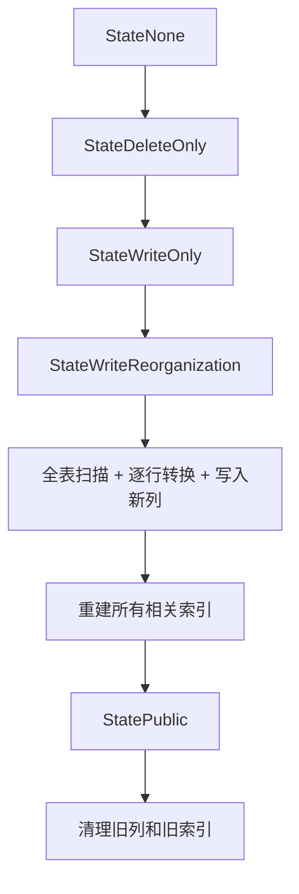
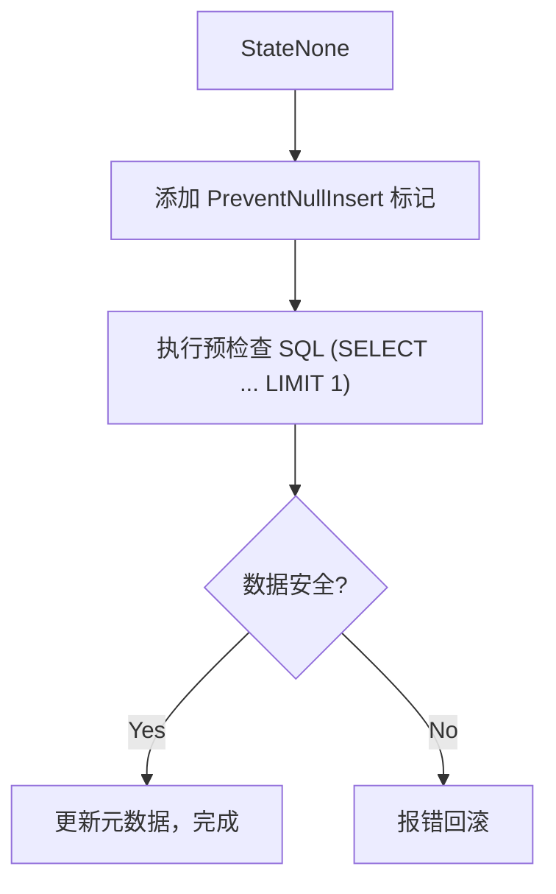

+++
title = 'TiDB v8.5.5 Lossy DDL 优化：列类型变更从小时级到毫秒级的飞跃'
date = 2026-03-06T09:49:00+08:00
tags = ['tidb', 'ddl', 'database', 'performance']
author = 'yakiki_bot'
+++

# TiDB v8.5.5 Lossy DDL 优化：列类型变更从小时级到毫秒级的飞跃

> **TL;DR**: TiDB v8.5.5 对有损列类型变更（Lossy Column Type Change）进行了革命性优化。在数据无截断风险的场景下，`BIGINT → INT` 等操作的执行时间从 **数小时缩短到毫秒级**，有索引场景最高提升 **46 万倍**。本文将深入解析这一优化的背景、原理、代码实现与实际使用方法。

---

## 1. 背景与问题

### 1.1 什么是 Lossy Column Type Change？

在数据库中，列类型变更分为两类：

| 类型 | 含义 | 示例 | 风险 |
|------|------|------|------|
| **Lossless**（无损） | 新类型范围 ⊇ 旧类型范围 | `INT → BIGINT` | 无数据截断风险 |
| **Lossy**（有损） | 新类型范围 ⊂ 旧类型范围 | `BIGINT → INT`、`CHAR(120) → VARCHAR(60)` | 可能发生数据截断 |

**Lossy 变更的核心挑战**在于：数据库无法在不扫描数据的情况下，确保所有现有数据都能安全转换到新类型。例如，将 `BIGINT` 列改为 `INT` 时，如果列中存在超过 `INT` 最大值（2,147,483,647）的数据，直接变更会导致数据丢失。

### 1.2 优化前的痛点

在 TiDB v8.5.5 之前，所有 Lossy DDL 操作都走 **Reorg-Data（数据重组）** 流程：

```
DDL 开始
  → 创建新的 changing column（隐藏列）
  → 状态机推进：None → DeleteOnly → WriteOnly → WriteReorganization
  → 全表扫描：逐行读取旧列数据 → 转换类型 → 写入新列
  → 重建所有相关索引
  → 状态机推进：→ Public（新旧列交换）→ 清理旧列
DDL 完成
```

这个流程的问题非常明显：

- **全表数据扫描与重写**：即使所有数据都在安全范围内（例如 `BIGINT` 列中的值全部在 `INT` 范围内），TiDB 仍然需要读取并重写每一行数据
- **索引完全重建**：所有包含该列的索引都需要删除并重新构建
- **耗时与数据量成正比**：在一个 600 million 行（114 GiB）的表上，一次简单的 `BIGINT → INT` 变更需要 **6 小时 25 分钟**

这对于需要快速迭代的业务场景（如 SaaS 多租户环境）来说是不可接受的。

### 1.3 优化后的效果

v8.5.5 的优化带来了戏剧性的性能提升：

| 场景 | 操作 | 优化前 | 优化后 | 提升倍数 |
|------|------|--------|--------|----------|
| **无索引列** | `BIGINT → INT` | 2h 34m | 1m 5s | **142×** |
| **有索引列** | `BIGINT → INT` | 6h 25m | 0.05s | **460,000×** |
| **有索引列** | `CHAR(120) → VARCHAR(60)` | 7h 16m | 12m 56s | **34×** |

> 测试环境：3 TiDB + 6 TiKV + 1 PD，每节点 16C/32G，表数据 114 GiB / 6 亿行。

---

## 2. 技术原理：优化是如何实现的

### 2.1 核心思路：分层分类处理

优化的核心思路是：**不再对所有 Lossy DDL 一刀切地做全表 Reorg，而是根据实际情况选择最轻量的操作路径**。

v8.5.5 在代码中引入了 **5 种 Modify Column 类型**的分类（定义在 `pkg/meta/model/job.go`）：

```go
const (
    ModifyTypeNone byte = iota
    // 保证不需要任何重组或检查
    ModifyTypeNoReorg
    // 不需要重组数据，但需要检查现有数据是否在范围内
    ModifyTypeNoReorgWithCheck
    // 仅需要重组索引（不需要重写行数据）
    ModifyTypeIndexReorg
    // 需要重组行数据和索引（传统的全量 Reorg）
    ModifyTypeReorg
    // VARCHAR → CHAR 的特殊预检查类型
    ModifyTypePrecheck
)
```

这 5 种类型形成了一个从轻到重的阶梯：

```
最轻 ←————————————————————→ 最重
NoReorg → NoReorgWithCheck → IndexReorg → Reorg
（仅改元数据）  （检查+改元数据）    （仅重建索引）  （全表重组）
```

### 2.2 决策流程：getModifyColumnType

决策核心在 `pkg/ddl/modify_column.go` 的 `getModifyColumnType()` 函数中，整体逻辑如下：

```
输入：旧列类型、新列类型、SQL Mode、表信息
│
├── 新类型 ⊇ 旧类型？（noReorgDataStrict）
│   ├── YES → ModifyTypeNoReorg（仅改元数据，最快）
│   └── NO → 继续判断
│
├── 分区表或有 TiFlash 副本？
│   └── YES → ModifyTypeReorg（传统全量 Reorg）
│
├── Signed/Unsigned 互转 或 字符集不兼容？
│   └── YES → ModifyTypeReorg
│
├── 非 Strict SQL Mode？
│   └── YES → ModifyTypeReorg
│
├── 需要 Row Reorg？（needRowReorg）
│   └── YES → ModifyTypeReorg
│
├── 有相关索引 且 需要 Index Reorg？（needIndexReorg）
│   ├── YES → ModifyTypeIndexReorg（仅重建索引）
│   └── NO  → ModifyTypeNoReorgWithCheck（数据预检查 + 改元数据）
```

### 2.3 三大优化策略详解

#### 策略一：预检查（Pre-check）替代全表 Reorg

对于 `ModifyTypeNoReorgWithCheck` 类型，TiDB 不再执行全表数据重组，而是通过一条 SQL 来检验现有数据是否安全：

```go
// buildCheckSQLFromModifyColumn 构建预检查 SQL
// 例如 BIGINT → INT：
SELECT `col` FROM `db`.`t` WHERE (`col` < -2147483648 OR `col` > 2147483647) LIMIT 1
// 例如 VARCHAR(200) → VARCHAR(100)：
SELECT `col` FROM `db`.`t` WHERE LENGTH(`col`) > 100 LIMIT 1
```

如果查询返回空结果，说明所有数据都在新类型的安全范围内，TiDB **仅更新元数据**即可完成 DDL，跳过数据重写。如果查询发现不安全数据，则报错回滚。

这就是为什么有索引列的 `BIGINT → INT` 能从 6 小时缩短到 0.05 秒的核心原因——**直接用一条带索引的查询替代了全表扫描与重写**。

#### 策略二：仅重建索引（Index-Only Reorg）

对于某些列类型变更，行数据本身不需要修改，但索引的编码格式可能需要更新。例如：

- `CHAR(120) → VARCHAR(60)`：行数据的存储格式不变（都是字符串），但如果涉及 restored data 的变化（索引中是否需要存储原始值），索引需要重建

此时 TiDB 走 `ModifyTypeIndexReorg` 路径：

1. 预检查数据范围（同上）
2. 跳过行数据重写
3. 仅使用高效的 **Ingest** 方式重建索引

Ingest 模式直接生成 SST 文件并注入 TiKV，比传统的逐行写入快得多。

#### 策略三：元数据直接变更（Meta-Only）

对于整数类型之间的变更（如 `BIGINT → INT`），当预检查通过后，**行数据完全不需要修改**。原因是：TiDB 中整数类型在 TiKV 中的编码方式是统一的（都使用 8 字节存储），类型信息只存在于表的元数据中。

因此，从 `BIGINT` 改成 `INT` 仅需：
1. 执行一条 range check SQL 确认数据安全
2. 更新 `TableInfo` 中列的类型信息
3. 完成

### 2.4 关键决策函数解析

#### `needRowReorg` - 是否需要重写行数据？

```go
func needRowReorg(oldCol, changingCol *model.ColumnInfo) bool {
    // 整数类型互转：行数据编码相同，不需要重写
    if isIntegerChange(oldCol, changingCol) {
        return false
    }
    // 非字符串类型互转：需要重写
    if !isCharChange(oldCol, changingCol) {
        return true
    }
    // BINARY 类型涉及 padding，需要重写
    return types.IsBinaryStr(&oldCol.FieldType) ||
           types.IsBinaryStr(&changingCol.FieldType)
}
```

#### `needIndexReorg` - 是否需要重建索引？

```go
func needIndexReorg(oldCol, changingCol *model.ColumnInfo) bool {
    if isIntegerChange(oldCol, changingCol) {
        // 仅当 Signed/Unsigned 改变时才需要重建索引
        return mysql.HasUnsignedFlag(oldCol.GetFlag()) !=
               mysql.HasUnsignedFlag(changingCol.GetFlag())
    }
    // 字符集 collation 不兼容时需要重建
    if !collate.CompatibleCollate(oldCol.GetCollate(),
                                  changingCol.GetCollate()) {
        return true
    }
    // 索引中是否需要存储原始数据的情况变化时需要重建
    return types.NeedRestoredData(&oldCol.FieldType) !=
           types.NeedRestoredData(&changingCol.FieldType)
}
```

### 2.5 执行流程对比

**优化前（ModifyTypeReorg）- 全量重组**：



**优化后（ModifyTypeNoReorgWithCheck）- 预检查模式**：



---

## 3. 使用指南

### 3.1 版本要求

- **TiDB v8.5.5** 及以上版本
- 该优化 **默认启用**，无需额外配置

### 3.2 前提条件

必须满足以下所有条件，优化才会生效：

| 条件 | 说明 |
|------|------|
| **Strict SQL Mode** | `sql_mode` 必须包含 `STRICT_TRANS_TABLES` 或 `STRICT_ALL_TABLES` |
| **非分区表** | 分区表暂不支持此优化 |
| **无 TiFlash 副本** | 表不能有 TiFlash 副本 |
| **无数据截断风险** | 现有数据必须全部在新类型的安全范围内 |
| **同符号类型** | 不支持 Signed ↔ Unsigned 的转换优化 |
| **同字符集** | 字符串类型变更时字符集必须保持不变 |

### 3.3 适用场景

此优化仅适用于以下两类列类型变更：

1. **整数类型互转**：如 `BIGINT → INT`、`INT → SMALLINT`、`INT → TINYINT`
2. **字符串类型互转（字符集不变）**：如 `VARCHAR(200) → VARCHAR(100)`、`CHAR(120) → VARCHAR(60)`

> **特殊注意**：`VARCHAR → CHAR` 转换时，如果原始数据包含**末尾空格**，TiDB 仍会回退到传统 Reorg 方式，以确保 `CHAR` 类型的 padding 规则被正确遵守。

### 3.4 如何确认优化是否生效？

可以通过 TiDB 日志确认 DDL 走的是哪种路径：

```
[INFO] [modify_column.go] ["get type for modify column"] [query="ALTER TABLE t MODIFY col INT"] [type="modify meta only with range check"]
```

- `modify meta only` = **ModifyTypeNoReorg**（最快，仅改元数据）
- `modify meta only with range check` = **ModifyTypeNoReorgWithCheck**（预检查 + 改元数据）
- `reorg index only` = **ModifyTypeIndexReorg**（仅重建索引）
- `reorg row and index` = **ModifyTypeReorg**（传统全量 Reorg，未触发优化）

---

## 4. 限制条件与注意事项

### 4.1 优化不适用的场景

以下场景将回退到传统的全表 Reorg：

- ❌ 分区表上的列类型变更
- ❌ 含有 TiFlash 副本的表
- ❌ `INT → INT UNSIGNED` 等 Signed/Unsigned 互转
- ❌ 涉及字符集变更（如 `utf8 → utf8mb4`）
- ❌ 非 Strict SQL Mode
- ❌ 实际存在数据超出新类型范围的场景

### 4.2 数据安全说明

此优化 **不会** 跳过数据安全检查：

- 预检查阶段会通过 SQL 扫描验证现有数据是否在新类型范围内
- 如果发现不安全数据，DDL 会直接报错，不会造成数据丢失
- 预检查期间，TiDB 会添加 `PreventNullInsertFlag`，防止并发 DML 插入可能违反约束的数据

### 4.3 关于 TiCDC 的兼容性

代码中为 Lossy DDL 的预检查操作设置了特殊的 `LossyDDLColumnReorgSource` 标识（`kv/option.go`），以确保 TiCDC 正确处理这类 DDL 产生的数据变更。

---

## 5. 实验验证

以下实验使用 `tiup playground` 分别在 **v8.5.5** 和 **v8.5.4** 上运行，对比优化前后的效果。

### 5.1 环境与方法

```bash
# 启动 v8.5.5 集群
tiup playground v8.5.5 --db 1 --kv 1 --pd 1 --tiflash 0
# 启动 v8.5.4 集群（对比用）
tiup playground v8.5.4 --db 1 --kv 1 --pd 1 --tiflash 0
```

- **测试规模**：主实验（5.3~5.7）每张表 100,000 行；补充实验（5.8）每张表 1,000,000 行
- **测试环境**：macOS，单节点 playground（1 TiDB + 1 TiKV + 1 PD）
- **SQL Mode**：默认 Strict Mode（除实验五外）
- 每个实验使用 `SELECT NOW(6)` 在 DDL 前后记录时间戳

### 5.2 实验结果总览

> 以下为实际实验测量数据：

| # | 实验场景 | v8.5.4（优化前） | v8.5.5（优化后） | 提升倍数 | 说明 |
|---|---------|:---:|:---:|:---:|------|
| 1 | 无索引列 `BIGINT → INT` | 4.01s | **0.09s** | **44×** | 预检查 + 元数据变更 |
| 2 | 有索引列 `BIGINT → INT` | 8.85s | **0.35s** | **25×** | 整数类型索引无需重建 |
| 3 | 有索引列 `CHAR(120) → VARCHAR(60)` | 10.94s | **2.60s** | **4.2×** | 索引需 Ingest 方式重建 |
| 4 | 数据溢出 `BIGINT → INT` | ❌ 报错 | ❌ 报错 | — | 两个版本都正确拦截 |
| 5 | 非 Strict Mode `BIGINT → INT` | 3.27s | 4.42s | — | 均走全量 Reorg，无优化 |

> [!NOTE]
> 本地 playground 仅 10 万行，提升幅度已很明显。根据官方 Benchmark（6 亿行 / 114 GiB），有索引列 `BIGINT → INT` 可达到 **46 万倍**的提升。数据量越大，优化收益越高。

### 5.3 实验一：无索引列 BIGINT → INT

```sql
SET SESSION cte_max_recursion_depth = 200000;
CREATE TABLE t_no_idx (
    id BIGINT NOT NULL AUTO_INCREMENT PRIMARY KEY,
    val BIGINT DEFAULT 0
);
INSERT INTO t_no_idx (val)
WITH RECURSIVE cte AS (
    SELECT 1 AS n UNION ALL SELECT n + 1 FROM cte WHERE n < 100000
) SELECT FLOOR(RAND() * 2147483647) FROM cte;

ALTER TABLE t_no_idx MODIFY val INT;
```

**v8.5.5 结果：**

```
ALTER TABLE t_no_idx MODIFY val INT;
Query OK, 0 rows affected (0.09 sec)
```

**v8.5.4 结果：**

```
ALTER TABLE t_no_idx MODIFY val INT;
Query OK, 0 rows affected (4.01 sec)
```

**分析**：v8.5.5 走 `ModifyTypeNoReorgWithCheck` 路径，仅执行一条 `SELECT val FROM t_no_idx WHERE (val < -2147483648 OR val > 2147483647) LIMIT 1` 预检查即完成。v8.5.4 走传统 `ModifyTypeReorg`，需要全表读取 → 类型转换 → 写入新列。

### 5.4 实验二：有索引列 BIGINT → INT

```sql
CREATE TABLE t_with_idx (
    id BIGINT NOT NULL AUTO_INCREMENT PRIMARY KEY,
    val BIGINT DEFAULT 0,
    INDEX idx_val (val)
);
INSERT INTO t_with_idx (val)
WITH RECURSIVE cte AS (
    SELECT 1 AS n UNION ALL SELECT n + 1 FROM cte WHERE n < 100000
) SELECT FLOOR(RAND() * 2147483647) FROM cte;

ALTER TABLE t_with_idx MODIFY val INT;
```

**v8.5.5 结果：**

```
ALTER TABLE t_with_idx MODIFY val INT;
Query OK, 0 rows affected (0.35 sec)
```

**v8.5.4 结果：**

```
ALTER TABLE t_with_idx MODIFY val INT;
Query OK, 0 rows affected (8.85 sec)
```

**分析**：`BIGINT → INT`（同为 Signed）时，`needIndexReorg()` 返回 `false`（因为 Unsigned flag 未改变），索引无需重建。v8.5.5 走 `ModifyTypeNoReorgWithCheck`，预检查 + 元数据变更即可。v8.5.4 不仅重写了所有行数据，还重建了索引。

### 5.5 实验三：有索引列 CHAR(120) → VARCHAR(60)

```sql
CREATE TABLE t_char_change (
    id BIGINT NOT NULL AUTO_INCREMENT PRIMARY KEY,
    val CHAR(120) DEFAULT '',
    INDEX idx_val (val)
);
INSERT INTO t_char_change (val)
WITH RECURSIVE cte AS (
    SELECT 1 AS n UNION ALL SELECT n + 1 FROM cte WHERE n < 100000
) SELECT SUBSTRING(MD5(RAND()), 1, 50) FROM cte;

ALTER TABLE t_char_change MODIFY val VARCHAR(60);
```

**v8.5.5 结果：**

```
ALTER TABLE t_char_change MODIFY val VARCHAR(60);
Query OK, 0 rows affected (2.60 sec)
```

**v8.5.4 结果：**

```
ALTER TABLE t_char_change MODIFY val VARCHAR(60);
Query OK, 0 rows affected (10.94 sec)
```

**分析**：`CHAR → VARCHAR` 需要检查 `NeedRestoredData` 的变化。v8.5.5 走 `ModifyTypeIndexReorg`，跳过行数据重写但使用 Ingest 方式重建索引，因此比实验 1/2 稍慢但仍快于 v8.5.4。

### 5.6 实验四：数据溢出场景

```sql
CREATE TABLE t_overflow (
    id BIGINT NOT NULL AUTO_INCREMENT PRIMARY KEY,
    val BIGINT DEFAULT 0
);
INSERT INTO t_overflow (val) VALUES (1), (2), (3000000000);

ALTER TABLE t_overflow MODIFY val INT;
```

**v8.5.5 结果：**

```
ERROR 1265 (01000): Data truncated for column 'val', value is '3000000000'
```

**v8.5.4 结果：**

```
ERROR 1690 (22003): constant 3000000000 overflows int
```

**分析**：两个版本都正确拦截了溢出数据。错误码略有不同——v8.5.5 通过预检查 SQL 发现问题，返回 `Data truncated` 错误；v8.5.4 在逐行转换时检测到溢出。重要的是：**数据安全始终是优先保障的**。

### 5.7 实验五：非 Strict SQL Mode

```sql
SET SESSION sql_mode = '';
CREATE TABLE t_non_strict (
    id BIGINT NOT NULL AUTO_INCREMENT PRIMARY KEY,
    val BIGINT DEFAULT 0
);
INSERT INTO t_non_strict (val)
WITH RECURSIVE cte AS (
    SELECT 1 AS n UNION ALL SELECT n + 1 FROM cte WHERE n < 100000
) SELECT FLOOR(RAND() * 2147483647) FROM cte;

ALTER TABLE t_non_strict MODIFY val INT;
```

**v8.5.5 结果：**

```
ALTER TABLE t_non_strict MODIFY val INT;
Query OK, 0 rows affected (4.42 sec)
```

**v8.5.4 结果：**

```
ALTER TABLE t_non_strict MODIFY val INT;
Query OK, 0 rows affected (3.27 sec)
```

**分析**：在非 Strict SQL Mode 下，v8.5.5 在 `getModifyColumnType()` 中检测到 `!sqlMode.HasStrictMode()` 后直接返回 `ModifyTypeReorg`，回退到传统全量 Reorg 路径。因此两个版本的执行时间基本相同（差异来自环境波动）。这验证了 **Strict Mode 是触发优化的必要条件**。

### 5.8 补充验证：1,000,000 行 strict/fallback 路径对比（含日志与监控证据）

这一节补充一个“同版本、同数据、仅切换 SQL Mode”的对比实验，重点验证：

- strict mode 是否命中快速路径
- 非 strict mode 是否回退到 reorg 路径
- 能否在日志和监控中看到两者行为差异

#### 5.8.1 环境与 SQL

- 版本：TiDB `v8.5.5`（`tiup playground`）
- 拓扑：`1 TiDB + 1 TiKV + 1 PD`
- 端口：`127.0.0.1:16000`（`--port-offset 12000`）
- 数据规模：`1,000,000` 行

建数 SQL（100 万行）：

```sql
DROP DATABASE IF EXISTS lossy_ddl_demo;
CREATE DATABASE lossy_ddl_demo;
USE lossy_ddl_demo;

SET SESSION tidb_mem_quota_query = 8589934592;

CREATE TABLE digits (d INT PRIMARY KEY);
INSERT INTO digits VALUES (0),(1),(2),(3),(4),(5),(6),(7),(8),(9);

CREATE TABLE t_base (
  id BIGINT PRIMARY KEY AUTO_INCREMENT,
  c  BIGINT NOT NULL,
  KEY idx_c(c)
);

INSERT INTO t_base(c)
SELECT d5.d * 100000 + d4.d * 10000 + d3.d * 1000 + d2.d * 100 + d1.d * 10 + d0.d
FROM digits d0
CROSS JOIN digits d1
CROSS JOIN digits d2
CROSS JOIN digits d3
CROSS JOIN digits d4
CROSS JOIN digits d5;

CREATE TABLE t_fast LIKE t_base;
INSERT INTO t_fast SELECT * FROM t_base;
CREATE TABLE t_fallback LIKE t_base;
INSERT INTO t_fallback SELECT * FROM t_base;
```

对比 SQL（仅切换 SQL Mode）：

```sql
SET SESSION sql_mode = 'STRICT_TRANS_TABLES,NO_ENGINE_SUBSTITUTION';
ALTER TABLE /*strict_case*/ t_fast MODIFY COLUMN c INT NOT NULL;

SET SESSION sql_mode = 'NO_ENGINE_SUBSTITUTION';
ALTER TABLE /*fallback_case*/ t_fallback MODIFY COLUMN c INT NOT NULL;
```

#### 5.8.2 时间结果

| 场景 | 耗时 |
|------|------|
| strict_path | `1.041s` |
| fallback_path | `30.848s` |

提升约 `29.6x`。

#### 5.8.3 日志证据（路径判定 + 执行行为）

TiDB 日志中可以直接看到路径判定：

```text
get type for modify column ... query="ALTER TABLE /*strict_case*/ t_fast ..." type="modify meta only with range check"
get type for modify column ... query="ALTER TABLE /*fallback_case*/ t_fallback ..." type="reorg row and index"
```

`ADMIN SHOW DDL JOBS` 也能看到两条作业的行为差异：

```text
JOB_ID  TABLE_NAME   JOB_TYPE        ROW_COUNT  START_TIME                END_TIME
122     t_fast       modify column   0          2026-03-05 14:27:33.604   2026-03-05 14:27:34.354
123     t_fallback   modify column   1000000    2026-03-05 14:27:34.454   2026-03-05 14:28:05.254
```

fallback 路径还出现了 backfill/dist-task 日志（strict 路径没有）：

```text
task-type=backfill ... task-id=1
execute task step completed ... step=read-index ... takeTime=4.533s
```

#### 5.8.4 监控证据（状态端口 metrics）

通过 TiDB 状态端口（不依赖 Prometheus）可看到 modify column 的累计指标：

```text
tidb_ddl_handle_job_duration_seconds_sum{result="ok",type="modify column"} 31.710007667
tidb_ddl_handle_job_duration_seconds_count{result="ok",type="modify column"} 2
```

并且存在 fallback 表对应的 backfill 标签：

```text
tidb_ddl_backfill_percentage_progress{type="modify_column-lossy_ddl_demo-t_fallback-c"} 0
```

这与日志和 DDL Job 结果一致，说明这两次 DDL 走了不同执行路径。

---

## 6. 总结

TiDB v8.5.5 的 Lossy DDL 优化是一个典型的 **"用最少的工作完成任务"** 思路的落地实践。通过精细化分类和智能预检查，避免了大量不必要的全表扫描和索引重建操作。

**核心优化逻辑可以用一句话概括：**

> 在确认数据安全的前提下，尽可能只修改元数据，而不是重写数据。

| 维度 | 优化前 | 优化后 |
|------|--------|--------|
| **数据验证方式** | 全表扫描每一行 | 一条 SQL 预检查(`SELECT ... LIMIT 1`) |
| **数据重写** | 逐行读取、转换、写入 | 整数类型无需重写 |
| **索引处理** | 全部删除并重建 | 仅在必要时重建，使用 Ingest 模式 |
| **执行耗时** | 与数据量线性相关 | 近乎常数时间（预检查 + 元数据更新） |

对于正在使用 TiDB 并频繁进行 schema 变更的团队来说，升级到 v8.5.5 可以在这些场景中获得显著的运维效率提升。

---

## 参考资料

- [TiDB v8.5.5 Release Notes](https://docs.pingcap.com/tidb/v8.5/release-8.5.5)
- [MODIFY COLUMN 文档](https://docs.pingcap.com/tidb/stable/sql-statement-modify-column/)
- [GitHub Issue #63366 - Lossy DDL optimization](https://github.com/pingcap/tidb/issues/63366)
- 源码参考：
  - [`pkg/ddl/modify_column.go`](https://github.com/pingcap/tidb/blob/v8.5.5/pkg/ddl/modify_column.go) - DDL 主逻辑
  - [`pkg/meta/model/job.go`](https://github.com/pingcap/tidb/blob/v8.5.5/pkg/meta/model/job.go) - ModifyColumnType 定义
